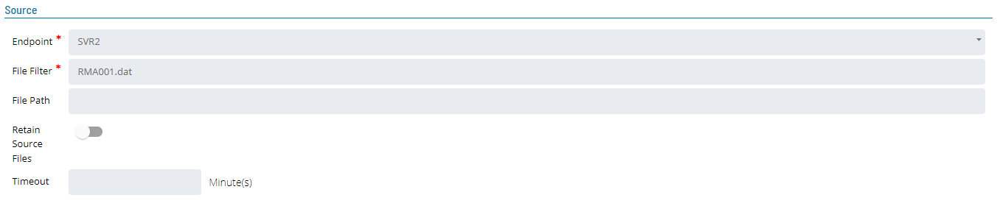
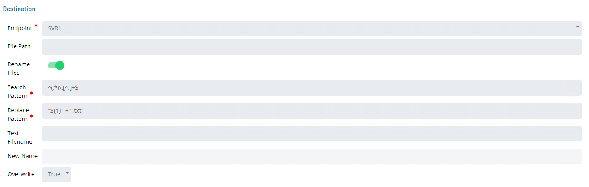
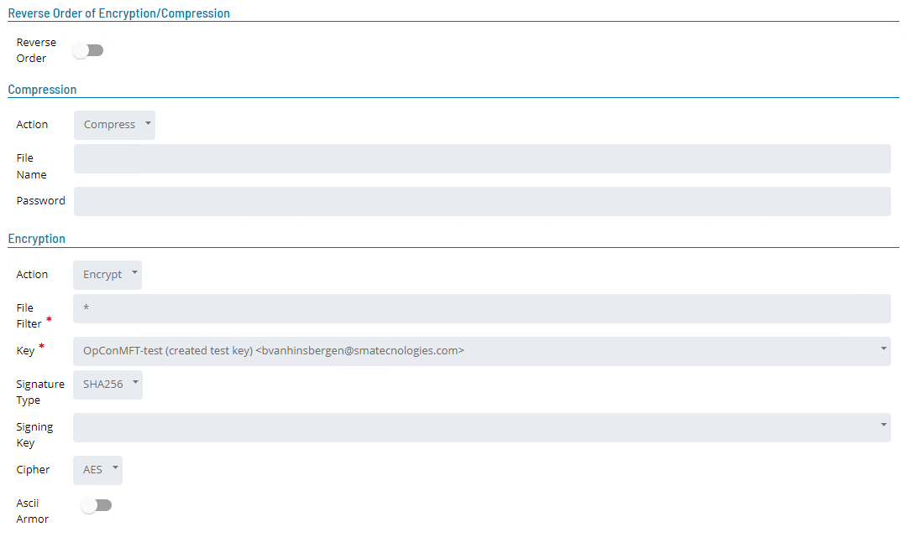
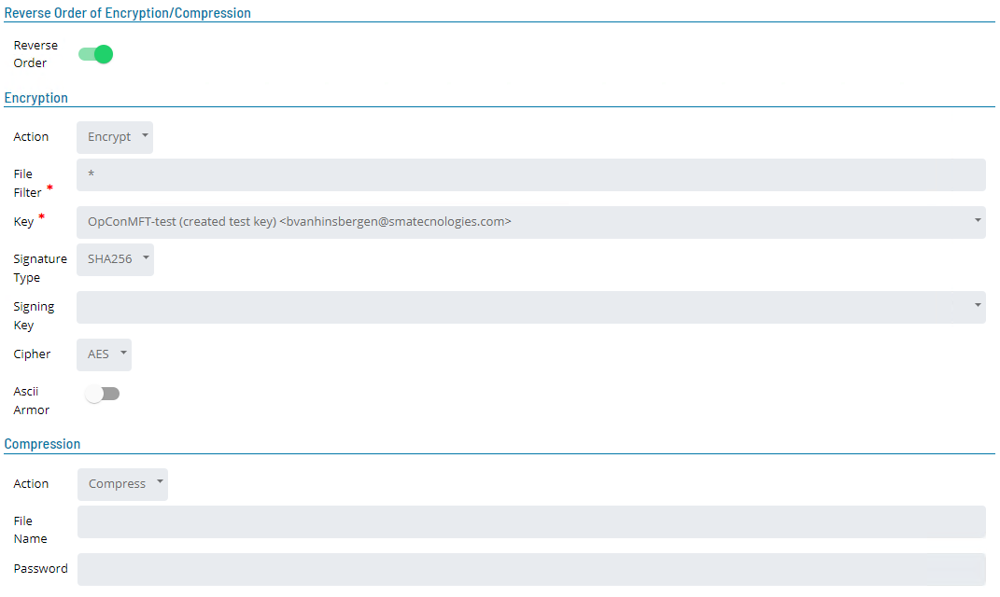
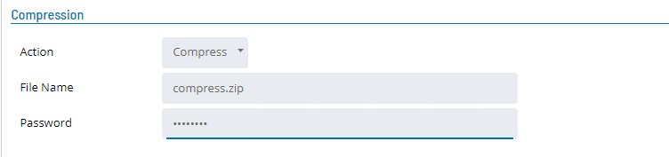
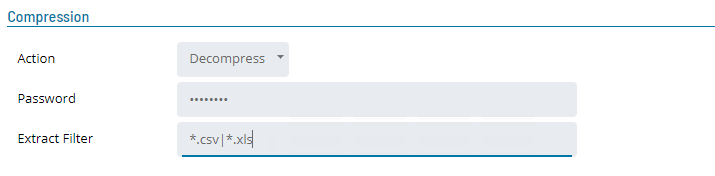
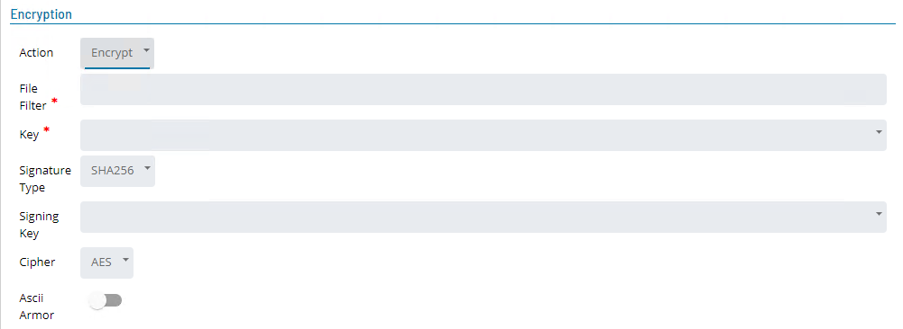
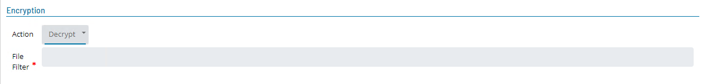

# MFT Agent Task Definitions

Tasks, endpoints and encryption information are defined using Solution Manager. Task Definitions are persisted within the OpCon database as
OpConMFT JobTypes while endpoints and encryption information is persisted in the OpCon MFT Agent database.

An OpCon MFT jobname consists of a **group** name and a **job** name (**_group-name.job-name_**). The jobname is generated by the software and consists
of the **Department Name** associated with the OpCon job (default **General**) and the OpCon jobname. All special characters and spaces are removed from these values.

```
Example

OpCon Department Name   : <General>
OpCon Jobname           : MFTJOB001 Test

OpCon MFT Agent jobname : General.MFTJOB001Test

```

## File Renaming

Renaming of files performs a filename search and replace on the files within the file set using regular expressions. The **_Rename Search Pattern_** field
of the **Destination** section contains the regular expression to match and the **_Rename Replace Pattern_** field of the **Destination** section contains
the regular expression to replace.

```
Examples

To rename the extension of the files in the file set .csv use the following definitions:

To append a date to all filenames (date format can be defined using tokens) in the file set use the following definitions:

  Rename Search Pattern   ^(.*)\.[^.]+$
  Rename Replace Pattern  "${1}.csv"

To add a date directory (date format can be defined using tokens) the files in the file set use the following definitions:

  Rename Search Pattern   \\output\\(.*)$
  Rename Replace Pattern  "\\output\\[[$SCHEDULE DATE-YYYYMMDD]]\\${1}"

```

## Tasks Overview

A task within the OpCon MFT Agent consists of multiple steps that are executed in a specific order. These invidual steps are persisted and provide
a restart point after a file transfer failure occurs.

An OpCon task has a unique jobId generated everytime an OpCon task is started or restarted. An OpCon MFT Agent task also has a unique jobId generated
everytime an OpCon MFT task is started. When a failed OpCon MFT task is restarted, the OpCon MFT task has a new jobId while the OpCon MFT task restarts
using the existing jobId.

Tasks operate on a "file set". A file set can be thought of as a group of files that a task step is currently working on. A particular task step may cause
files to be added to the current file set, removed from the file set, or a combination of the two. In order to implement this aspect correctly, the files
belonging to the file set are stored locally on disk, in the Data\ directory for the corresponding job. This allows the Retry Run feature to work correctly
without inadvertently duplicating steps for a given file.

**Supported Job Steps**.

While the OpCon MFT Agent supports mans different steps, the OpConMFT JobType currently supports the following steps:

- **get** step is associated with an endpoint and creates the file set according to the File Filter information that will be used for the subsequent steps.
- **put** step is associated with an endpoint and delivers the file set to the defined location.
- **compress** step is used to compress a file set.
- **decompress** step is used to decompress a file set.
- **encrypt** step is used to encrypt a file set according to the encryption information.
- **decrypt** step is used to decrypt a file set according to the encryption information.
- **name** step is used to rename the files when they are delivered to the destination.

### Task Definition

When defining OpCon MFT Tasks Source and Destination information must be defined while Compression and Encryption information is optional.

#### Source

The Source section defines the information for the **_get_** step so a file set can be created.

The **_get_** step searches the defined **_File Path_** for file names that match the **_File Filter_** definition. Matching files are added to the task's file set. Subsequent task steps operate on this file set. If no matching files are found within the defined **_Timeout_** period this step returns an error and the remaining task steps are not processed.



| Field                   | Description                                                                                                                                                                                                                                                                                                                                                                                                                      |
| ----------------------- | -------------------------------------------------------------------------------------------------------------------------------------------------------------------------------------------------------------------------------------------------------------------------------------------------------------------------------------------------------------------------------------------------------------------------------- |
| **Endpoint**            | Select the required endpoint from the dropdown list (the list includes both local and remote (site) endpoints). This defines which endpoint to use to retrieve the file set. A local endpoint is relative to the installed OpConMFT Agent and is either a UNC Path or a Windows directory. When using a UNC Path, the user associated with the OpConMFT Agent must have the required privileges to access the required file set. |
| **File Filter**         | This defines the files to be included in the file set. It supports wild cards (?) and (\*) as well as multiple definitions seperated by the pipe ('\|') character (i.e. \*.csv\|\*.xls). When requiring all files in the directory the definition \* should be used instead of \*.\* as the second definition will only select files that have a name and and extension.                                                         |
| **File Path**           | An optional definition that defines the path to check for files to add to the file set. If present the value is relative to the default definition associated with the endpoint.                                                                                                                                                                                                                                                 |
| **Timeout**             | An optional field that indicates how many minutes the **_get_** step should wait for the source files if no files are present when the task starts (default value is 1 minute).                                                                                                                                                                                                                                                  |
| **Retain Source Files** | This field indicates if the source files associated with the **_get_** step should be removed after the file set is created (values True : False - default False).                                                                                                                                                                                                                                                               |
| **Reprocess Files**     | This field indicates if the source files associated with the **_get_** step can be reprocessed after the file has been previously processed (values True : False - default False).                                                                                                                                                                                                                                               |

#### Destination

The Destination section defines the information for the **_put_** step where the file set is to be created.

The **_put_** step places the files in the file set in the destination **_File Path_**.



| Field               | Description                                                                                                                                                                                                                                                                                                                                                                                                                                |
| ------------------- | ------------------------------------------------------------------------------------------------------------------------------------------------------------------------------------------------------------------------------------------------------------------------------------------------------------------------------------------------------------------------------------------------------------------------------------------ |
| **Endpoint**        | Select the required endpoint from the dropdown list (the list includes both local and remote (site) endpoints). This defines the endpoint to use defining where to place the file set. A local endpoint is relative to the installed OpConMFT Agent and is either a UNC PATH or a Windows directory. When using a UNC Path, the user associated with the OpConMFT Agent must have the required privileges to access the required file set. |
| **File Path**       | This is an optional definition that defines the path where the files should be placed. If present the value is relative to the default definition associated with the endpoint.                                                                                                                                                                                                                                                            |
| **Overwrite**       | Select what should happen from the dropdown list if the destination files associated with the **_put_** step already exist (values True : Append : False - default True).                                                                                                                                                                                                                                                                  |
| **Rename Files**    | Select this field if renaming of files in the target system is required. When selected, the **_Search Pattern_**, **_Replace Pattern_**, **_Test Filename_** and the **_New Name_** fields will appear.                                                                                                                                                                                                                                    |
| **Search Pattern**  | This field consists of a Regex string indicating what to search for in the file name. This field works with the **_Replace Pattern_** field.                                                                                                                                                                                                                                                                                               |
| **Replace Pattern** | This field consists of a Regex string indicating what the replacement text should be if a match is found. This field works with the **_Search Pattern_** field.                                                                                                                                                                                                                                                                            |

### Reverse Order of Encryption/Compression

This function appears when Encryption is selected. It is used to reverse the order of the steps. When creating a send data task, the standard sequence of steps is to first **_compress_** the file set and then **_encrypt_** the file set. There may be occasions when the required step sequence is to first **_encrypt_** the file set and then **_compress_** the file set. The **Reverse Order** field performs this function. Similarly, when creating a retrieve data task, the standard sequence of steps is to first **_decrypt_** the file set and then **_decompress_** the file set. There may be occasions when the required step sequence is to first **_decompress_** the file set and then **_decrypt_** the file set. The **Reverse Order** field also performs this function.

| Field             | Description                                                                                                                                                 |
| ----------------- | ----------------------------------------------------------------------------------------------------------------------------------------------------------- |
| **Reverse Order** | This defines the step sequence order for compression and encryption tasks. (values true : false - default false meaning **_compress_** then **_encrypt_**). |





#### Compression

The optional Compression section defines the information for the **_compress_** or **_decompress_** steps.

| Field      | Description                                                                                                    |
| ---------- | -------------------------------------------------------------------------------------------------------------- |
| **Action** | Select the Compression action from the dropdown list (values are None : Compress : Decompress - default None). |

##### Compress Action

The **_compress_** step includes all files associated with the file set into a zip archive file. Files added to the zip archive are removed from the current file set so they are not passed on to the next step in the task.



| Field         | Description                                                                                                                                     |
| ------------- | ----------------------------------------------------------------------------------------------------------------------------------------------- |
| **File Name** | An optional definition that defines the name of the zip file to create. The default zip filename is the name of the first file in the file set. |
| **Password**  | An optional definition that defines a password that can be added to the compressed file.                                                        |

##### Decompress Action

The **_decompress_** step inflates compressed files from the current file set. Any decompressed files that match the specification setting are added to the task's current file set. The input file that was decompressed is removed from the file set so it is not passed on to the next task step. The decompress step applies the standard File Filters (\*.zip|\*.z|\*.gz|\*.bz2) when looking for files to decompress.



| Field              | Description                                                                                                                                                                                                                                                                         |
| ------------------ | ----------------------------------------------------------------------------------------------------------------------------------------------------------------------------------------------------------------------------------------------------------------------------------- | -------------------------------------------------- | -------- |
| **Password**       | An optional definition that defines a password that must be used to decompress the file.                                                                                                                                                                                            |
| **Extract Filter** | The compressed file could contain multiple files and it is therefore possible to only require specific files within the compressed file. Use **\*** to extract all files or specific files by defining a file type using wild cards. Multiple types can be entered using the pipe ( | ) character as a separation character (i.e. \*.csv | \*.xls). |

#### Encryption

The optional Encryption section defines the information for the **_encrypt_** or **_decrypt_** steps.

| Field      | Description                                                                                               |
| ---------- | --------------------------------------------------------------------------------------------------------- |
| **Action** | Select the Encryption action from the dropdown list (values are None : Encrypt : Decrypt - default None). |

##### Encrypt Action

The **_encrypt_** step is used to encrypt files in the task's current file set with a specific PGP public key. The encrypted output files replace their associated input source files in the file set that is passed to the task's next step. The encrypted output files are named by adding a .pgp extension to the source file name. For example, if the source file is named **_{filenamepart}_** then the output file will be named **_{filenamepart}_**.pgp.



| Field              | Description                                                                                                                                                                                                                                                                                                                                                               |
| ------------------ | ------------------------------------------------------------------------------------------------------------------------------------------------------------------------------------------------------------------------------------------------------------------------------------------------------------------------------------------------------------------------- |
| **File Filter**    | This defines the files of the file set to be included in encrypted file. It supports wild cards (?) and (\*) as well as multiple definitions seperated by the pipe ('\|') character (i.e \*.dt1\|\*.dt2). When requiring all files in the file set \* should be used instead of \*.\* as the second definition will only select files that have a name and and extension. |
| **Key**            | Unique identifier of the public key used for encryption. Select the key name from the dropdown list.                                                                                                                                                                                                                                                                      |
| **Signature Type** | The encoding type used to encode the Signing Key. Select the encoding type from the dropdown list (values MD5 : RIPE160 : SHA1 : SHA256 : SHA512 : SHA3 - 256 : SHA3 - 512 - default SHA256).                                                                                                                                                                             |
| **Signing Key**    | Digital signature enabling the recipient of the file to verify the authenticity of the information's origin, and also verify that the information has not been tampered with. Select the Signing key name from the dropdown list.                                                                                                                                         |
| **Cipher**         | Select the symmetric cipher to be used to encrypt the file set from the dropdown list (values are CAST5 : AES : AES192 : IDEA : Blowfish : Twofish : 3DES - default AES).                                                                                                                                                                                                 |
| **Ascii Armor**    | Indicates whether the encrypted representation of a file should consist entirely of printable ASCII characters (values true : false - default false).                                                                                                                                                                                                                     |

##### Decrypt Action

The **_decrypt_** step decrypts PGP (or GPG) encrypted source files in the current file set. The decrypted output files replace the encrypted source files in the current file set that is passed on to the next step in the job.



| Field           | Description                                                                                                                                                                                                                                                                                                                                              |
| --------------- | -------------------------------------------------------------------------------------------------------------------------------------------------------------------------------------------------------------------------------------------------------------------------------------------------------------------------------------------------------- |
| **File Filter** | This defines the files of the file set to be decrypted. It supports wild cards (?) and (\*) as well as multiple definitions separated by the pipe ('\|') character (i.e \*.dt1\|\*.dt2). When requiring all files in the file set \* should be used instead of \*.\* as the second definition will only select files that have a name and and extension. |

### Failure Criteria

An OpCon MFT task successfully completes with a return code of 0, which is the default setting.
(need a list of error codes)
