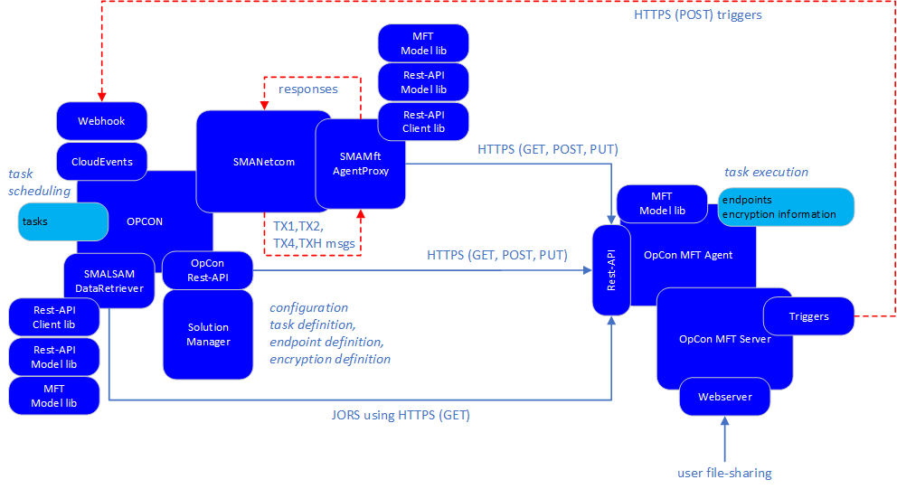

# Architecture

An alternate to the traditional OpCon - Agent - Application integration approach was developed providing a simpler integration approach for future applications. 

The approach requires that the application to be integrated supports a Rest-API, which then allows the application to function as the OpCon Agent. Enhancements 
to the SMANetcom module provides new functionality that communicates directly with the application using standard Rest-API calls (GET, POST, PUT, DELETE).

OpCon provides the following functions:
- stores the task definition as an OpConMFT Jobtype. 
- additions to the OpCon Rest-API to support the new OpConMFT Jobtype.
- extensions to the OpCon Rest-API to route requests to the OpconMFT Agent Rest-API.  
- the communication between OpCon and the OpConMFT Agent through SMANetcom. 
- schedules the task.
- additions to JORS environment to retrieve the job log from the OpConMFT Agent.

Solution Manager provides the following functions:
- screen definitions for defining OpConMFT Jobtypes.
- screen definitions for defining endpoints in the OpConMFT Agent.
- screen definitions for defining encryption information in the OpConMFT Agent.

OpCon MFT Agent provudes the following functions:
- stores endpoint definitions.
- stores encryption definitions.
- executes tasks sumitted by OpCon.

The SMANetcom module has been enhanced to support connections to a remote application using Rest-API calls.

## SMANetcom
A new capability has been added to SMANetcom allowing SMANetcom to directly interact with a Rest-API. The implementation requires a ProxyAgent which provides 
the mapping between the traditional SMANetcom TX Messages and the Rest-API endpoints of the associated application. 

The capability implements a message queuing capability to pass requests to the ProxyAgents. The ProxyAgents returns data to SMANetcom via callback methods 
provided on each request.  

The OpCon Agent LsamTypeId provides the indication that this agent type is a Rest-API agent and should be managed by the new capability. A LSAMTYPEID of 90 
or greater will be interpreted as a Rest-API agent.

During SMANetcom startup if a Rest-API agent is detected, the specific Rest-API agent information is retrieved from the database (address, port, token, etc). The 
ProxyAgent for the Rest-API is started passing the address, port and token information. A TX4 message type is then generated passed to the ProxyAgent. During normal 
operations a TXH message is generated and passed to the ProxyAgent. These messages are used to determine if the application is available and will set the specific 
OpCon Agent into an **available** or **unavailable** status for task processing.

SMANetcom retrieves TX messages (TX1 or TX2) from the MSGS_TO_NETCOM table, checks the LSAMTYPEID of the message and if this is a Rest-API agent places it on the 
approriate queue for the target ProxyAgent. The ProxyAgent processes the messages and returns the correctly formatted responses which are placed in the MSGS_TO_SAM
table.

## OpConMFT AgentProxy
The OpConMFT AgentProxy provides the link between SMANetcom and the OpConMFT Agent which is a services running on a Windows Server. 

The ProxyAgent uses various libraries to support the communications between SMANetcom and the Rest-API application.

The AgentProxy accepts the standard TX messages from SMANetcom and maps them to the Rest-API endpoints supported by the OpConMFT Agent. The returned data from the 
Rest-API requests are reformatted to TX message responses which are passed to the SMANetcom infrastructure via the CallBack methods. The ProxyAgent uses the
 **Rest API Library**, **Rest-API Model Library** and the **MFT Model Library** when communicating with the OpConMFT Agent Rest-API.

Whenever an OpCon task is started, a unique jobId is generated for the OpCon task. This means that if a task is restarted, a new jobId will be generated for the task. 
This approach allows the information for specific task executions to be visible within the OpCon environment. OpConMFT has a similar implementation and every time a task
is started by the OpConMFT Agent a new jobId will be generated. The OpConMFT Agent maintains a table mapping the OpCon unique jobId (Integer portion) to the OpConMFT 
jobId.

When restarting a failed OpConMFT task, a new opCon jobId wil be generated, but this will then be redirected to the failed OpConMFT task jobId. The OpConMFT task then
restarts from the failed step.

### TX1 Message
A task in OpConMFT is defined by a GROUPNAME.JOBNAME value. When defining a task, the Department name of the task is used as the group name and the jobname of the task
is used for the jobname. Any special characters are removed from the group and jobnames. 
 
The ProxyAgent receives a TX1 message from SMANetcom and checks to see if the OpConMFT jobId is 0. If the value is 0 then a new OpCon MFT task will generated. If the 
value is non zero, then the existing OpConMFT task must be restarted.

#### New Task
The ProxyAgent receives a TX1 message from SMANetcom and maps this to a **/api/job/start{groupName}.{correctedJobName}/withtag/{tagName}** POST function where the 
tagName is the integer portion of the OpCon unique jobId. The request responds with the OpConMFT Agent jobId. The job running status, the OpCon Agent JobId and a 
JORS file identifier are returned to SMANetcom and passed to OpCon where the OpCon Agent jobId and JORS file identifier are stored in the SMASTER_AUX table 
associated with the OpCon task.

The ProxyAgent then monitors the started task for completion (either successful or failed) by first retrieving the runid using **/api/run/bytag/{tagName}** a GET
function where the tagName is the integer portion of the OpCon unique jobId to get the OpConMFT Agent task jobId and then using the **/api/run/status/{runid}** GET
function to retrieve the status of the opConMFT Agent task. During each execution, if the task is still active, the contents of the **last_message** field is 
returned to OpCon. If the job completes and it is successful, a 0 value for OpConAgent JobId will be returned as well as the completion code. If the OpConMFT task 
failed, only the completion code will be returned.  

#### Restart Task
(need information on implementation to complete the documentation)

### TX2 Message
(need information on implementation to complete the documentation)

### TX4 Message
The ProxyAgent receives a TXç message from SMANetcom when SMANetcom starts or the OpConMFT Agent is set to an active state and maps this to a **api/agent/info** GET 
function. This is used to see if the OpConMFT Agent is available. If a response is received, a positive response is returned to SMANetcom. If an exception occurs a 
negative response is returned to SMANetcom and the OpConMFT Agent is set in a down state (not available). Currently the OpConMFT Agent version is returned which is
passed to SMANetcom and returned to opCOn where it is saved in the MACHS_AUX table.  

### TXH Message
The ProxyAgent receives a TXH message from SMANetcom on a timed basis and maps this to a **api/agent/info** GET function. This is used to see if the OpConMFT 
Agent is available. If a response is received, a positive response is returned to SMANetcom. If an exception occurs a negative response is returned to SMANetcom and 
the OpConMFT Agent is set in a down state (not available). 

## SMALSAMDataRetriever
The LSAMDataRetriever has been modified to check for OpConMFT job log requests. The SMALSAMDataRertriever uses the **Rest API Library** the **Rest-API Model Library** 
and the **MFT Model Library** when communicating with the OpConMFT Agent Rest-API.  

The JORS information passed to SMALSAMDataRetriever includes the OpConMFT Agent name and the Integer portion of the OpCon jobId. The agent information is extracted 
from the OpCon database and a connection is established to the OpCon MFT Agent. 

The job log consists of the OpConMFT Agent task status information and the step information associated with the OpConMFT Agent task. The JORS request is first mapped to 
**/api/run/bytag/{tagName}** GET function to retrieve the jobId of the OpConMFT Agent task associated with the OpCon task. Once the jodid is retrieved, a 
**/api/run/status/{runid}** GET function is submitted to retrieve the status information of the OpConMFT Agent task, followed by a **/api/run/bytag/{tagName}** GET 
function to retrieve the step information of the OpConMFT Agent task. 

## Solution Manager
When defining an OpConMFT task endpoint and encryption information must be retrieved from the OpConMFT Agent through the OpConMFT Rest-API. Solution Manager itself 
does not connect directly to the OpCon MFT Rest-API. Instead Solution Manager interacts only with the OpCon Rest-API. The OpCon Rest-API server retrieves the 
information from the associated OpConMFT Agent.

## Rest-API Client Library
This library provides a set of generalized Rest-API calls required for communicating with a Rest-API application. It includes authentication methods as well as GET,
POST and PUT methods. It is used by the **ProxyAgent** agent and the **LSAMDataRetriever** to submit requests to the OpConMFT Agent.

## Rest-API Model Library
This library provides a set of generalized models that are used by the **Rest-API Client Library**. It also includes a specific OpConMFT module to provide additional 
functions to support the OpConMFT Agent. These additional functions are used by the **ProxyAgent** to convert the task definition information received from SMANetcom
(TX1 message) to the JSON definition that the **/api/job/start** endpoint requires.

## MFT Model Library
This library provides the model definitions used by the OpConMFT Agent Rest-API. It is used by the **ProxyAgent** and the **LSAMDataRetriever** when submitting requests
to the OpConMFT Agent Rest-API.  
