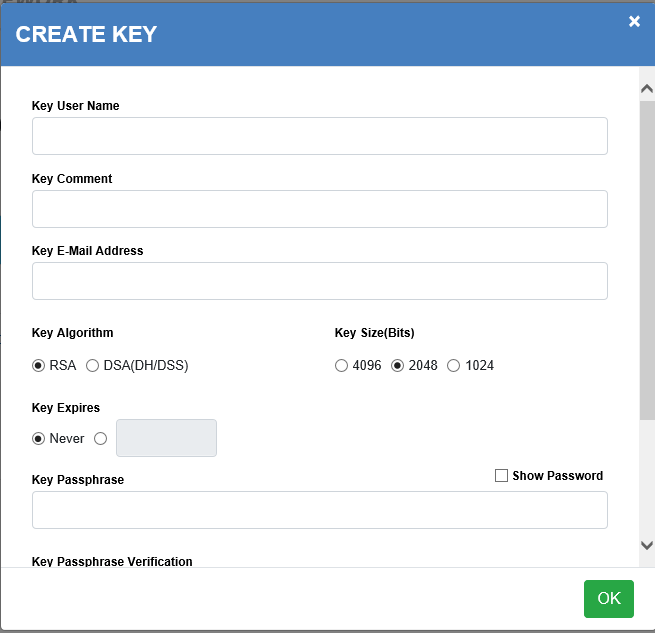
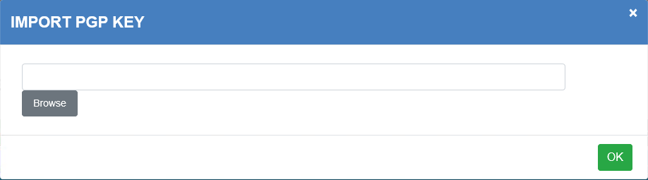
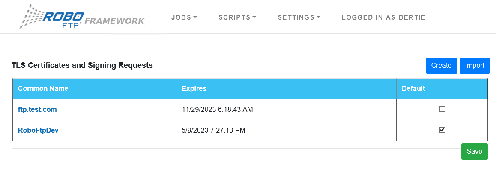
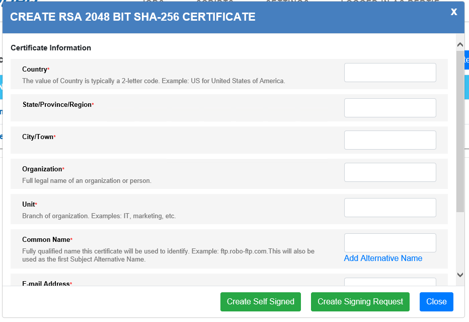
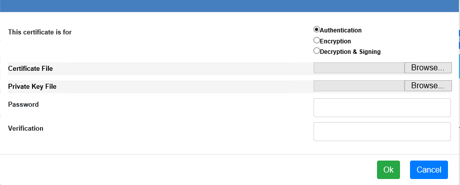
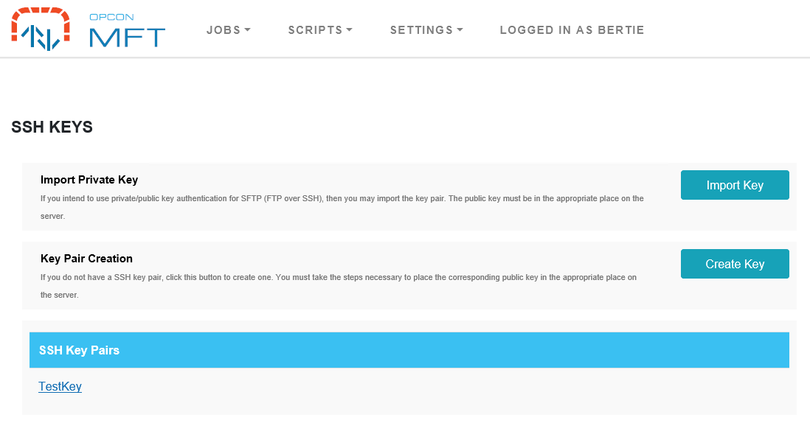
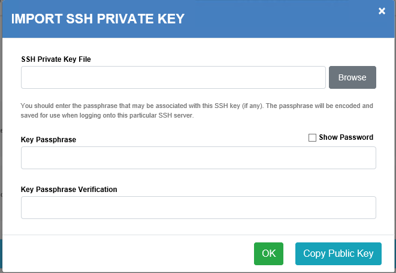
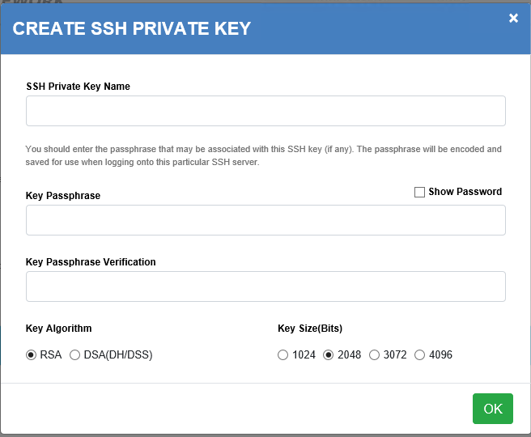

# Encryption Definitions

The OpConMFT Agent incorporates the ability to encrypt and decrypt files using PGP cryptography and to manage a PGP keyring. PGP is a commonly recognized method 
of what is referred to as strong cryptography. Cryptography is the science of using mathematics to encrypt and decrypt data. PGP cryptography enables you to protect 
sensitive information when it is stored locally or transmitted across the Internet, so that it cannot be read by anyone except the intended recipient.

To use PGP in conjunction with OpConMFT, you and the FTP site must be in agreement to use PGP cryptography. Furthermore, you most likely would not use PGP cryptography 
when connecting to a secure SSH or TLS FTP site.

PGP utilizes public key cryptography. Public key cryptography is a scheme that uses a pair of keys for encryption: a public key, which encrypts files, and a corresponding 
private, or secret key for decryption. You provide your public key to anyone you want to receive the encrypted information from while keeping your private key secret.

Anyone with a copy of your public key can then encrypt information that only you can read. Conversely, If you have someone else’s public key, you can encrypt information 
that only they can read - in other words, only the person who has the corresponding private key can decrypt the information.

PGP, as implemented by the OpConMFT Agent, permits you to create keys of three different sizes (measured in bits): 1024, 2048, and 4096. Larger keys will be cryptographically 
secure for a longer period of time. If what you want to encrypt needs to be hidden for many years, you might want to use the largest key. OpConMFT Agent stores keys in an 
encrypted form on disk. As you use PGP, you will typically import the public keys of your recipients. If you lose your private key, you will be unable to decrypt any information 
encrypted with its associated public key.

When encrypting a file, the public key of the recipient must be specified. Keys are identified by any combination of user name, comment, and/or e-mail address. This combination 
will be referred to as the key name. 

PGP encrypted files may contain digital signatures. Digital signatures enable the recipient of a file to verify the authenticity of the information's origin, and also verify 
that the information has not been tampered with. A digital signature also prevents the sender from claiming that he or she did not actually send the information. Therefore, 
a digital signature serves the same purpose as a handwritten signature in that it attests to the contents of the information as well as to the identity of the signer. The 
signature verifies that as long as the senders private key has not been compromised after they sent it.

PGP key files and encrypted files may be saved in a format referred to as ASCII armored. This format is an encrypted representation of a file consisting entirely of printable 
ASCII (or text-mode only) characters. Files in this format contain no binary values, and therefore may be easily sent as part of e-mail messages and visually examined using 
programs like Notepad.

## OpConMFT PGP Implementation
The OpConMFT Agent is a FTP client and not a comprehensive PGP encryption tool, but does provide the basic functionality required to utilize PGP.

The following functionality is provided by the OpConMFT Configurator:
 
- The creation of private and public key(s).
- The ability to export public keys to ASCII armored and non-ASCII armored files. ASCII armored key files are plain-text files; non-armored files are in a binary format. Exported public key files are signed by the matching  private key, if it is available.
- The ability to export public and private key pairs to be shared with other applications that need to access your pgp encrypted files. The private key will still be encrypted with its passphrase.
- The ability to import key(s)
- The ability to delete key(s)

PGP has the added advantage of compression. Much like a zip file, files that are encoded using PGP are also compressed. These file(s) are expanded and restored to their original state when they are decrypted by their intended recipient.

## Using PGP with OpConMFT
PGP encryption is defined using the OpConMFT Agent Web Server. Once this information is defined, it can be used by tasks for encryption and decryption. From the initial page, select 
**SETTINGS** and then **PGP KEYS** for defining PGP information.

To use PGP with OpConMFT, you must have your own PGP public/private key-pair. You can either create a new one or you can import one.

To encrypt a file with OpConMFT, you must have imported the recipient's public key before encryption.

To decrypt a file with OpConMFT, you must have exported your public key and sent it to the person who will be encrypting the file before they encrypt it.

### Creating a New Key-Pair

Click the ***Create Key*** button.

Field                           | Description
------------------------------- | -----------
**Key User Name**               | Required. Is the name that will be assigned to this key-pair consisting of alphanumeric characters. 
**Key Comment**                 | A comment associated with the definition.
**Key E-Mail Address**          | An email address associated with the definition.  
**Key Algorithm**               | Select the algorithm (***RSA, DSA(DH/DSS)***).
**Key Size**                    | Select the algorithm (***4096, 2048, 1024***).
**Key Expires**                 | Select the key expiration (***Never or enter an expiration date***).
**Key PassPhrase**              | Define a Passphrase.
**Key PassPhrase Verification** | Re-enter the Passphrase for verification.
**Save PassPhrase**             | Select ***Save Passphrase*** to store it in the encrypted password store for use for automatic use with OpConMFT PGP commands.

When completed select the **OK** to save the new definition.

### Importing a Key-Pair, Public Key or a Keyring

Click the ***Import Key*** button. 

You may import a key-pair, Public key, or a whole keyring into OpConMFT by following these steps:

Field                           | Description
------------------------------- | -----------
**Browse**                      | Browse to the folder where the key or keyring is located. The key pair you are importing may be a single file, or could be several, depending on the application it was created on and exported from.

When completed select the **OK** to save the new definition.

Related: OpConMFT's Implementation of PGP, Backing up OpConMFT's PGP Keys

See also: OpConMFT and PGP Cryptography, Configure PGP Menu

## TLS Certificates and Signing Requests
A certificate is a digitally signed document that identifies a person, organization, or server and provides a copy of their public key for encryption. The digital signature may either be 
that of a third party Certificate Authority (CA) or the certificate may have been ***self-signed*** by its creator. The CA may be a well-known public organization that investigates and 
verifies the identity of an applicant before signing a certificate on their behalf or it could be software running on a server on your company's internal network. Data encrypted with 
the certificate's public key can only be decrypted using the private key held by the owner of the certificate.

In addition to the signature, a typical digital certificate also contains: the identity of the site, the identity of the person or organization that signed the certificate, the certificate's 
expiration date, the ID of the algorithm used to create the signature, the public key used for encryption, a cryptographic ***thumbprint hash*** to ensure that the contents of the certificate 
have not been modified, and a brief description of the intended purpose of the certificate. 

Every type of TLS connection supported by OpConMFT derives its encryption from a trusted server host certificate while only the most secure connections also require client certificates. The 
primary purpose of client certificates is to authenticate the user and is used in lieu of a password on some servers. OpConMFT provides a tool that allows you to generate your own client-side certificate. With OpConMFT, you can specify a different client certificate for each managed site or define one default client certificate to use whenever a client certificate is required.

### Trusting a Certificate
OpConMFT will not establish a TLS connection unless it trusts the server's certificate. OpConMFT automatically trusts a certificate signed by a previously trusted Certificate Authority. The 
operating system maintains a list of trusted CAs and OpCOnMFT provides a method allowing you to explicitly trust a certificate not on the list.

### TLS Connections
OpConMFT uses the Transport Layer Security (TLS) protocol for FTPS and HTTPS connections. The Secure Sockets Layer (SSL) protocol was developed by Netscape to add privacy, integrity and 
authentication to the standard HTTP protocol but it ultimately became the normal method for securing almost all internet traffic. After SSL version 3.0, the protocol was renamed to TLS. 
The process of establishing a TLS connection is sometimes referred to as "negotiation" or a "handshake."

#### Establishing Unilateral Connections
In a unilateral TLS connection, only the server computer provides a certificate. To establish a unilateral connection, OpConMFT requests a secure connection from a remote site. If the remote 
server is capable, it responds agreeing to the secure connection and providing a TLS certificate. If OpConMFT trusts the server's certificate it creates a temporary random encryption key, 
encrypts it using the server's public key, and sends it back to the server. Because the temporary key was encrypted using the server's public key it can only be decrypted with the server's 
private key. At this point the temporary key is a secret known only to OpConMFT and the server. The temporary key is used to encrypt all subsequent communication between OpConMFT and the server 
for the duration of the TLS session and is discarded when the session ends.

#### Establishing Bilateral Connections
In some enterprise situations where security is a special concern, the remote server may require OpConMFT to provide a client certificate to prove your identity before agreeing to the TLS connection. This is known as a bilateral connection or "mutual authentication."  

### Using TLS with OpConMFT
Certificates are defined using the OpConMFT Web Server. Once this information is defined, it can be used by tasks for encryption and decryption. From the initial page, select 
**SETTINGS** and then **TLS CERTIFICATE** for defining PGP information.

Click the ***Create Key*** button.

Field                     | Description
--------------------------| -----------
**Country**               | Required. The value of Country is typically a 2-letter code. Example: US for United States of America. 
**State/Provive/Region**  | Required. A value indicating the state, province or region within the country.
**City/Town**             | Required. the name of the city or town within the state, province or region.  
**Organization**          | Required. Full legal name of an organization or person.
**Unit**                  | Required. Branch of organization. Examples: IT, marketing, etc.
**Common Name**           | Required. Fully qualified name this certificate will be used to identify. Example: ftp.opcon-mft.com.This will also be used as the first Subject Alternative Name.
**E-mail Address**        | Required. Valid email address associated with the certificate.
**Password**              | Required. The password associated with the certificate.
**Verify Password**       | Required. Retype the password in the verification box.

When completed select the **Create Self Signed** to create a self-signed certificate or **Create Signing Request** to generate a signing request that can be sumitted to a CA.

Click the ***Import Key*** button to import a certificate received from a CA.

Field                     | Description
--------------------------| -----------
**Certificate Usage**     | Required. Select what the certificate what be used for (***Authentication, Encryption, Decryption & Signing***). 
**Certificate File**      | Required. The file name of the supplied key file. If you only have a single file with a .p12 or .pfx extension it may be a PKCS #12 container file. That type of file may hold both a public certificate and its matching private key. To import a PKCS #12 file containing both, enter the file name in the Certificate File field and leave the Private Key File name field empty.
**Private Key File**      | The file name of the private key file, if provided.  
**Password**              | Required. The supplied password used during certificate import.
**Verification**          | Required. Password verification.

When completed select the **OK** to import the certificate.

## SSH Keys
Secure File Transfer Protocol (SFTP) is a method of transferring files between a client and server over a secure, encrypted connection (as opposed to regular FTP, which functions over an insecure connection). The security in SFTP comes through its integration with the SSH (or Secure Shell) protocol. SSH provides an encrypted transport layer over which the SFTP commands are executed, and over which files are transferred. Regular FTP connections usually utilize port 21 for connections, while SSH servers use port 22.

OpConMFT supports both password and private key authentication for SFTP connections.

When negotiating a connection with a remote SFTP server, OpConMFT requires SSH2 and chooses ciphers in the following order: AES (any type) > Triple DES > Blowfish. OpConMFT selects the key exchange algorithm from the following set in order of preference:

- 1.diffie-hellman-group-sha256
- 2.diffie-hellman-group14-sha1
- 3.diffie-hellman-group1-sha1

OpConMFT supports SFTP transfers over SSH. The specific security method is dictated by the remote site and OpCOnMFT SSH to be compatible with as many servers as possible. 
When negotiating a secure connection, OpCOnMFT automatically downloads the necessary encryption details from the remote server. In the case of SSH it downloads the host's public key. The first time you connect to any particular secure site you must decide if you trust the server's certificate or key. If you trust the server's credentials, OpConMFT stores a copy of them for future use. On subsequent connection attempts, OpCOnMFT compares the site's current credentials to the trusted copies and automatically connects if the credentials match.

Every type of secure connection supported by OpConMFT requires that you trust the remote server but some sites require more than a simple username and password before they trust you. In these situations you can configure OpConMFT to upload your personal client certificate or public key. You can use the OpConMFT Configurator to define default credentials to use with all secure sites or set specific personal credentials for each managed site. The Configurator also contains tools which allow you to generate your own SSH keys.

From the initial page, select **SETTINGS** and then **SSH KEYS** for defining SSH Key information. 

Field                           | Description
------------------------------- | -----------
**Import Private Key**          | If you intend to use private/public key authentication for SFTP (FTP over SSH), then you may import the key pair. The public key must be in the appropriate place on the server.
**Key Pair Creation**           | If you do not have a SSH key pair, click this button to create one. You must take the steps necessary to place the corresponding public key in the appropriate place on the server.

### Import SSH Private Key
To import a SSH key, select the **Import Private Key** function and the **IMPORT SSH PRIVATE KEY** dialogue appears.

Field                           | Description
------------------------------- | -----------
**SSH Private Key File**        | Select the file containing the key information to import.
**Key PassPhrase**              | You should enter the passphrase that may be associated with this SSH key (if any). The passphrase will be encoded and saved for use when logging onto this particular SSH server.
**Key PassPhrase Verification** | Re-enter the passphrase for verification.

When completed select the **OK** to import the SSH Key.
If necessary seletc **Copy Public Key** to extract a copy of the public key.

### Key Pair Creation
To create a SSH key, select the **Key Pair Creation** function and the **CREATE SSH PRIVATE KEY** dialogue appears.

Field                           | Description
------------------------------- | -----------
**SSH Private Key Name**        | Enter a name for the SSH Private Key.
**Key PassPhrase**              | You should enter the passphrase that may be associated with this SSH key (if any). The passphrase will be encoded and saved for use when logging onto this particular SSH server.
**Key PassPhrase Verification** | Re-enter the passphrase for verification.
**Key Algorithm**               | Select the algorithm to use (***RSA or DSA(DH/DSS)***).
**Key Size (bits)**             | Select the key size (***1024, 2048, 3072, 4096***).

When completed select the **OK** to import the SSH Key.
If necessary select **Copy Public Key** to extract a copy of the public key.