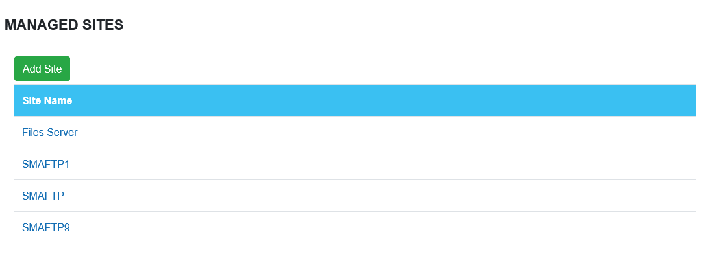
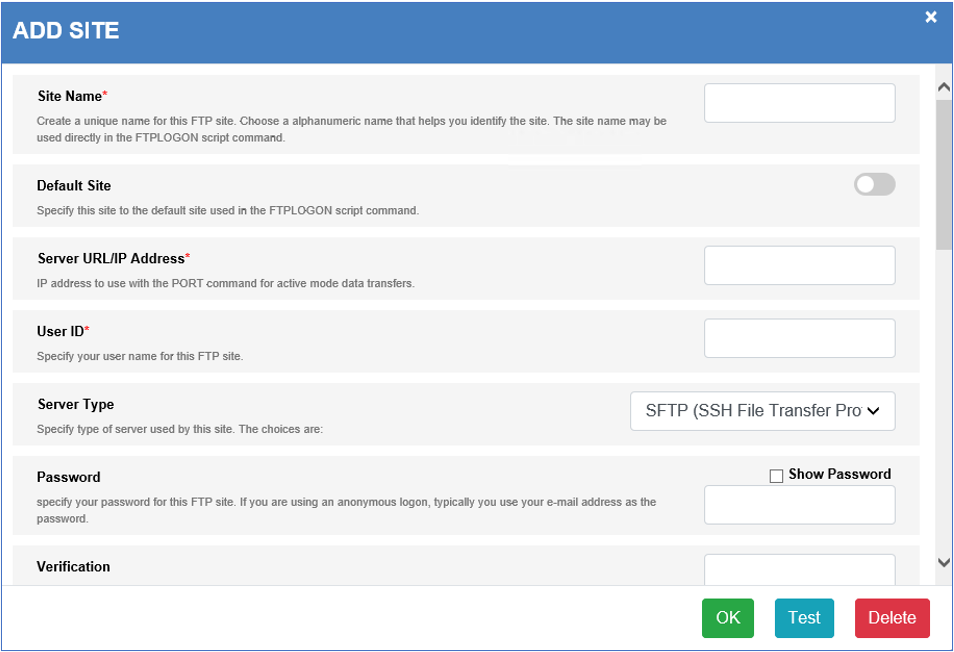

# Endpoint Definitions
Endpoints are currently defined using the OpCon MFT Agent Web Server. A connection to the OpCon MFT Agent Web Server requires a user / password for system where the OpCon MFT Agent is installed (not an OpCon user).

To define Endpoints, edit the associated OpCon MFT agent details using Solution Manager.
Select the **OpCon MFT Agent Settings** TAB and then select either **Path Endpoints** for defining UNC paths or directories or **Manage Sites** for defining remote servers.
Enter the credentials for the OpCon MFT Agent Web Server in the pop-up window and you will be routed to Endpoints associated with the OpCon MFT Agent. 

There are two types of endpoints:

Endpoint Type | Description
------------- | -----------
**Path**      | A path endpoint (Local Endpoint) is either a UNC path ***\\\\server\\directory*** or a path that includes the drive ***c:\\directory***.
**Site**      | A site (Managed Sites) is a remote location such as a FTP, FTPS, SFTP, SSH, S3, HTTP or HTTPS servers. When defining UNIX / Linux endpoints SFTP (SSH File Transfer protocol) should be used and FTP, FTPS, HTTP, HTTPS or S3 for other servers.

### Defining Path Endpoints

From the menu, select **Path Endpoints**.

To edit an endpoint, select the endpoint or select **Add Site** to create a new path endpoint.

Field                        | Description
---------------------------- | -----------
**Site Name**                | (Required) A unique name that is used to identify the endpoint consisting of alphanumeric characters. 
**Directory**                | (Required) The location where the data can be retrieved or placed. The value is a UNC or drive path. This value forms the initial portion of the location and any values entered in the **File Path** definition of the **Source** or **Destination** sections during task definition will be appended to this value. 

When completed select the **OK** to save the new definition or changes.

### Defining Site Endpoints
From the menu, select **Managed Sites**.

To edit an existing definition, select the definition or select **Add Site** to create a new site.

Field                        | Description
---------------------------- | -----------
**Site Name**                | (Required) This is a unique name that is used to identify the site consisting of alphanumeric characters. 
**Default Site**             | Not relevant to OpCon MFT implementation. 
**Server URL/IP Address**    | (Required) IP address to use with the PORT command for active mode data transfers. 
**User ID**                  | (Required) Specify the user name for this FTP site. 
**Server Type**              | (Required) Select the server type from the dropdown list (***FTP, FTPS (FTP + TLS) Control + data, FTPS (FTP + TLS) Control only, FTPS (FTP + TLS) Data only (CCC), FTPS Imlplicit (FTP + Implicit TLS), SFTP (SSH File Transfer Protocol), HTTP 1.1, HTTPS (HTTP 1.1 + Implicit TLS), Amazon Web Services S3***).
**Password**                 | (Required) Specify the password for this FTP site. If using an anonymous logon, typically an e-mail address can be used as the password.
**Verification**             | (Required) Re-enter the password.
**Compression**              | Select the compression level from the dropdown list (***Disabled, Fastest, Faster, Normal, Better, Maximum***).
**Limit Transfer Rate**      | If enabled, specify the approximate maximum transfer rate (in kilobytes per second) for uploads and downloads. Specify ***0*** or ***Unlimited*** to enable data transfer at the fastest speed possible. For example, to limit to roughly ***100*** kilobytes per second of bandwidth, enter ***100*** into this field. 
**Initial Server Directory** | Specify an FTP site directory to set as the default directory (current working directory) upon a successful logon. 
**Initial Local Directory**  | Specify the local folder to set as the active (current) folder upon a successful log on. 
**Default Transfer Mode**    | Select the default file transfer mode from the dropdown list (***Binary, Ascii, Ebcdic***). This is the transfer mode used when files are sent or received using the OpCon MFT client applet. When running a script, this is the transfer mode used unless it is overridden with the /type option in the SENDFILE or RCVFILE commands. The default is binary (***Binary***). ***Ebcdic*** mode is enabled only when IBM Host Features has been selected when configuring the site.
**Connection Port**          | Change the port number used by server at this site. Do not change this value unless specifically directed to do so by an FTP site system administrator. The default value is 21. 
**Time Out**                 | Specify the default time-out period (in seconds) to wait for a logon to complete or for interruptions in sending or receiving files to be resolved. This time-out may be used separately, or in conjunction with the FTP retries control, to recover from failed logons. The default value is 60 seconds.
**Retry Count**              | How many attempts to retry the transfer. 
**Retry Delay**              | The delay between retry attempts. 
**SSH Key Auth**             | Enable SSH key or SSL certificate authentication. 
**Ignore Directory Errors**  | Check this to allow changing into directories whose existence cannot be verified (SFTP and HTTP only).
**Proxy Settings**           | If enabled, specify the proxy settings.

Once defined, test connectivity by selecting the **Test** button. When performing a test, if the connection information does not work, the system will ask if it should
scan through the various protocol options. If one is found, it will ask if this should be saved. 

When completed select the **OK** to save the new definition or changes.

