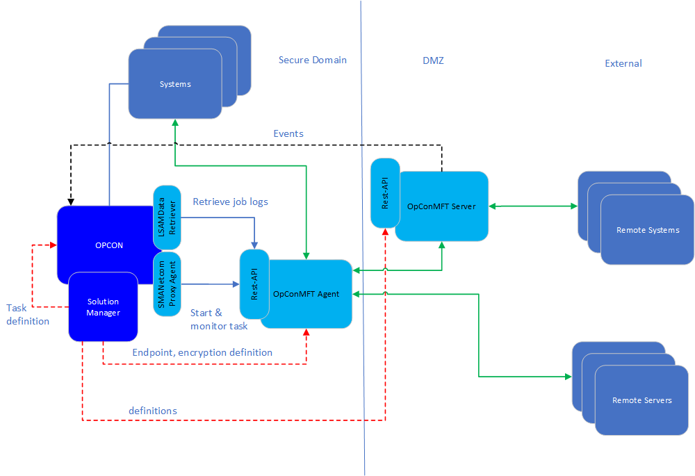

# OpCon MFT

OpCon MFT is a Managed File Transfer product integrated within the OpCon environment providing a comprehensive file transfer capability across
the Enterprise.

OpCon MFT consists of two major components that are integrated with OpCon using the Rest-API capabilities supported by the components.

Component | Description
------------------- | -----------
**OpConMFT Agent**  | The client providing B2B file transfer functionality. 
**OpConMFT Server** | The full FTP server environment for receiving and routing incoming data as well as file sharing capabilities. 

The OpCon MFT environment comprises of many components that work together to provide the full Managed File Transfer (MFT) solution.

## Solution Manager
Provides the User interface for the Managed File Transfer environment and provides capabilities for OpCon MFT Agent configuration, OpCon MFT Server 
activation, OpCon MFT task definition, defining endpoints, encryption information, a dashboard providing file transfer status and query functions for 
current and previous executions. 

During task definition, the endpoint and encryption information is retrieved from the OpCon MFT Agent and provided in dropdown lists 
allowing the user to select the appropriate values. Task definitions are stored within the OpCon environment, while endpoint and encryption 
information is stored within the OpCon MFT Agent environment. 

## OpCon MFT ProxyAgent
The OpCon MFT ProxyAgent provides the communications connections between OpCon and the OpCon MFT Agent. The ProxyAgent accepts the traditional OpCon 
TX messages from SMANetcom, mapping them to OpCon MFT Agent Rest-API calls. 

At a task start request, the OpCon unique jobId (integer portion) is passed to the OpCon MFT Agent along with the task definition information. The ProxyAgent receives the OpCon MFT unique jobId as part of a successful task start and this value is saved in the OpCon database for restarting a failed OpCon MFT task.

The ProxyAgent continuously monitors the status of the OpCon MFT Agent marking the Agent as available or unavailable for job starts.

## LSAMDataRetriever
The LSAMDataRetriever has been modified to support the retrieval of job logs from the OpCon MFT Agent through the OpCon MFT Rest-API. The joblog provides
information about the task as well as each step executed within the task.

## CloudEvents
CloudEvents is a new OpCon feature that accepts trigger messages through a webhook and allows the mapping of trigger messages to actions. For OpCon MFT Server supports 
trigger messages such as file upload, file download, file deleted, file moved, directory deleted, etc. 
Trigger filters are defined on the incoming messages and once a match is obtained, the associated Trigger event (OpCon event) will be passed to the OpCOn environment for action.

## OpCon MFT Rest-API
The OpCon MFT ProxyAgent communicates with the OpCon MFT Agent through the OpCon MFT Rest-API. 
The Rest-API provides the following functionalities:
- Start an OpCon MFT Agent task.
- Monitor an OpCon MFT task.
- Get the current status of an OpCon MFT task.
- Retrieve the job log of an OpCon MFT task.
- Retrieve a list of configured endpoints and encryption information for task definition.
- Register OpCon MFT Server connection to OpCon Webhook for trigger submission.

## OpCon MFT Agent 
The OpCon MFT Agent provides a file transfer capability for B2B interactions. It supports the submission and retrieval of data files between
systems using a wide range of protocols such as FTP, FTPS, SFTP, SSH, S3, HTTP, HTTPS, optionally using compression and or encryption.
File transfers are performed between endpoints, which can be either **local** or **site**. 

There are two types of endpoints, local or site. 

Type       | Description
---------- | -----------
**local**  | references a file location (either UNC path or Windows path) relative to the Server that the OpCon MFT Agent is installed on. 
**site**   | references a remote system and defines the the address, port, protocol and credentials required to access the site.

An OpCon MFT task consists of multiple steps representing the received task definition. These steps consist of creating the file set for the transfer,
optionally using compression and or using encryption on the file set and transferring the file set to the destination.

During the task execution, the OpCon MFT Agent persists each completed step. If a step fails and the task is restarted, the task will restart from the 
failed step.

## OpCon MFT Server 
The OpCon MFT is an additional component of the OpCon MFT Agent. It provides full file server functionality as well as user file-sharing capabilities. 
It supports the forwarding of triggers to the OpCon CloudEvents feature enabling OpCon to perform actions on the forwarded triggers.  