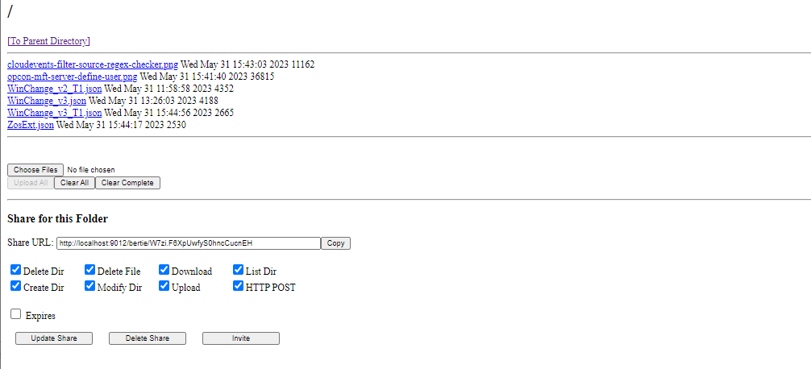

# MFT Server File Sharing

A User Directory page is only accessible to an individual user account after logging in from their web browser with their username and password. Here, you can view the entire directory structure accessible to that user account, download files, and upload files. 

Additionally, from this interface you can also generate links to special **shared** directories, or Shares, which do not require an account to access. Shares can have their permissions restricted using the appropriate checkbox. For example:
- You can allow users to download but not upload or delete files. 
- An expiration date for the share can be set, after which the Share will no longer be publicly accessible. 
- You can also delete or update a Share using the "Delete" / "Update" buttons on this page. 
- Only one Share can be created for a given User Directory.

To enable web file sharing, the HTTP port value must be set (see MFT Server Installation).

Once logged into the server using your browser, you manage the files associated with your user code, upload / download files or create a share.

Files can be viewed by selecting the file, once selected the file is downloaded and can then be viewed in an appropriate tool on your system.
To upload files, select the **Choose Files** button which opens a file explorer on your system. Once the files have been selected select the
**Upload All** button to upload the selected files.

## Sharing a Directory
To share the directory, decide on the options (by selecting / de-selecting the associated checkbox), if expiry is required, select the checkbox
and enter an expiry date. 

Select the **Update Share** button.

Select the **Copy** button to the right of the **Share URL** field. This value can then be sent to users so they can have access to the share
directory.