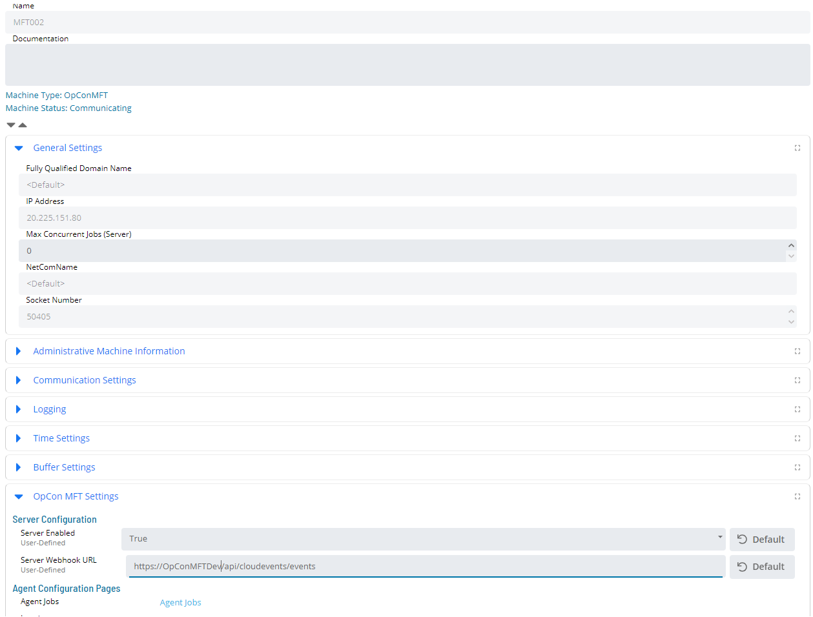
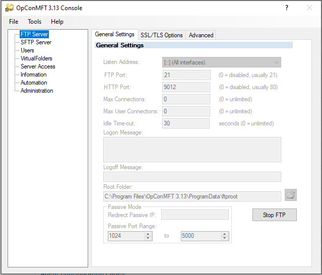
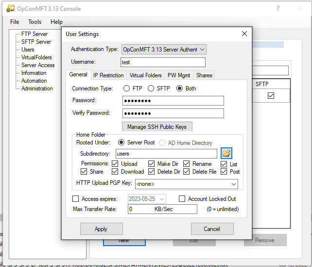

# MFT Server Installation

## License Keys

### Task Based License 2.0

>***Before starting an installation, an updated OpCon License key including a license for the OpConMFT Server must be obtained. Failure to do this will result in the OpCon MFT Agent Type not being visible within Solution Manager.***

### Other License Types

>***Before starting an installation, an updated OpCon License key including an OpConMFT Agent type and an OpConMFT Server must be obtained. Failure to do this will result in a license Violation when the defined OpCon MFT agent is activated in OpCon and will result in OpCon termination if the activated OpConMFT Agent is not deactivated within the specified time.***

## General

OpCon MFT Server requires OpCon version 22.4 or greater and OpCon MFT version 3.13.1 or greater.

The OpCon MFT Server is installed automatically as part of the OpCon MFT Agent. 

An updated key containing the OpCon MFT Server License must be applied to the OpCon Environment associated with the MFT installation before starting the installation
process. It will not be possible to complete the Webhook registration process as the capability will only be enabled once a key has been registered.

The OpCon MFT Agent must be configured and communicating with the OpCon environment before installing the OpCon MFT Server.

The installation process consists of the following:
- Webhook registration.
- Configure and start the OpCon MFT server.
- Define OpCon MFT Server users.

## Webhook Registration

The OpCon MFT Server submits all triggers associated with the server to the OpCon environment through an OpCon CloudEvents Webhook. For this to work, the OpCon MFT
Server must be authenticated as a valid user. This requires that the OpCon MFT Server is registered as a Webhook user receiving the authentication
token from OpCon to be used with all POSTs to the OpCon Webhook. The registration process submits a request to the OpCOn MFT Agent Rest-API providing
the information necessary to initialize the connection between the OpCon MFT Server and the OpCon CloudEvents Webhook.

-----

Using Solution Manager, select the OpCon MFT Agent which supports the required OpCon MFT Server (remember: this agent must already be authenticated) and select the OpCon MFT Settings TAB.

Using the OpCon MFT Settings TAB

- Enable the associated OpCOn MFT Server by setting the **Server Enabled** field to **True**.
- Set the **Server WebHook URL** field to **https://(OpCon Server)/api/cloudevents/events** which is the url of the OpCon Webhook. SSL is used for this connection, and so when entering the name of the server in the Webhook URL, the format must use the full name that matches the OpCon server name in the certificate. If OpCon and OpCon MFT are installed on the same server, use the value `localhost`.

- Select **Save** to save the updated configuration.

When the configuration is saved, the OpCon environment will submit a request to the OpCon MFT Agent to register the OpCon MFT Server with the OpCon CloudEvents Webhook.

This results in two messages being displayed:
- Configuration saved.
- Webhook Registered Successfully.

## Configure and start the OpCon MFT server

Start the OpCon MFT Server Console, by Selecting the **Server Console** in the **OpConMFT n.nn** Application Menu.

Select the **FTP Server** Menu Item.

To enable web file sharing, set a port number for the HTTP port value. It is better to use a specific port instead of the default port (80).
Select the **Start FTP** button to start the FTP Server.

For additional information on fields associated with configuring the FTP / SFTP server, open the help file associated with the OpCon MFT Server.

Start the OpCon MFT Server Help file by Selecting the **Server Help File** in the **OpConMFT n.nn** Application Menu.

***Server Console -> FTP Server ***
***Server Console -> SFTP Server ***

## Define OpCon MFT Server users 

All users that will retrieve or deposit files on the OpCon MFT Server must be configured directly within the server. 

Start the OpCon MFT Server Console, by Selecting the **Server Console** in the **OpConMFT n.nn** Application Menu.

Select the **Users** Menu Item.
Select **New** to create a new user.
Select a user in the list and select **Edit** to make changes to the user definition.
Select a user in the list and select **Remove** to remove the user.

For additional information on fields associated with a user definition open the help file associated with the OpCOn MFT Server.

Start the OpCon MFT Server Help file, by Selecting the **Server Help File** in the **OpConMFT n.nn** Application Menu.

***Server Console -> Users***

