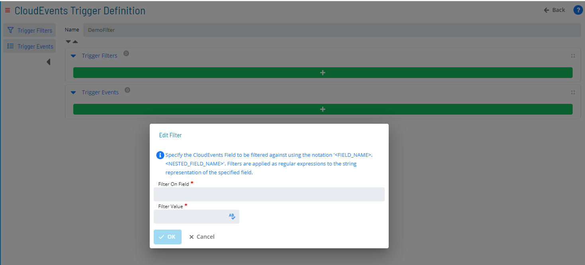
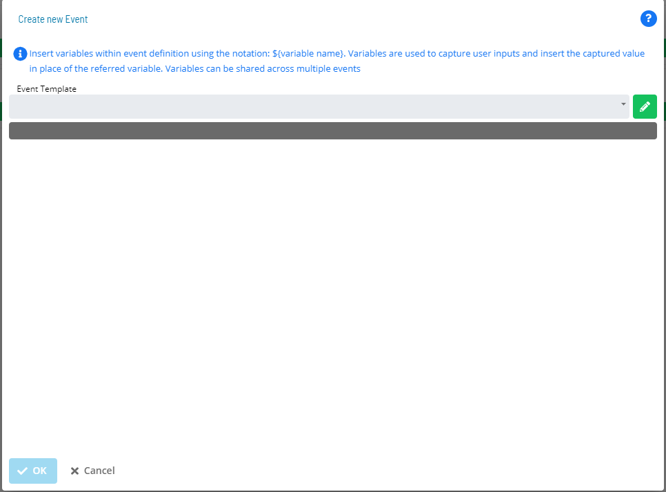
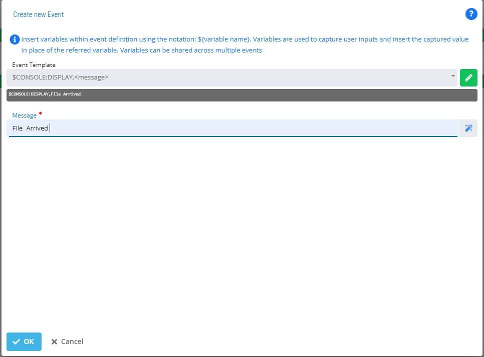
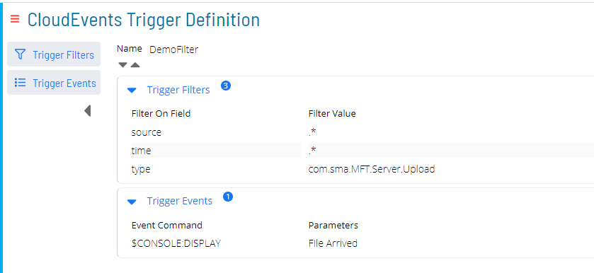

# Triggers
OpCon supports a new capability called CloudEvents which allows events to be submitted to OpCon through a Webhook. 

OpCon MFT Server supports various triggers that are automatically forwarded to the OpCon CloudEvents environment allowing OpCon to perform actions based on the incoming triggers. These triggers are submitted to OpCon through the OpCon CloudEvents Webhook. During configuration, the OpCon MFT Server is registered with the OpCon CloudEvents Webhook. The registration process ensures that the OpCon MFT server is known to the OpCon system and abel to submit triggers. If the OpCon MFT Server is not correctly registered with the OpCon system all incoming triggers will be ignored.

## Event Trigger Types
The following event trigger types are supported:

Trigger ID | Trigger Type                      | Description
---------- | --------------------------------- | -----------
**0**      | MFT Server Logon                  | user logon occurred 
**1**      | MFT Server Logoff                 | user logoff occurred
**3**      | MFT Server Upload                 | a file was uploaded to the MFT server
**4**      | MFT Server Download               | a file was downloaded from the MFT server
**6**      | MFT Server Start                  | the OpCon MFT server has started
**7**      | MFT Server Copy File              | a file on the MFT server has been copied
**8**      | MFT Server Move File              | a file has been moved within the MFT server      
**9**      | MFT Server Move Directory         | a directory has been moved within the MFT server      
**10**     | MFT Server Delete File            | a file has been deleted from the MFT server 
**11**     | MFT Server Delete Directory       | a directory has been deleted from the MFT server   

## Using CloudEvents
The CloudEvents implementation allows the mapping of incoming trigger events to OpCon Events allowing OpCon to perform actions based on the trigger events received. 
Trigger filters are defined to reference specific event triggers received and Trigger Events define the action to be taken.

To define trigger filter event mapping open the **CloudEvents Triggers** item in the **Library Management** section of Solution Manager.

To define a CloudEvent, first define the Filter (what to look for).

- Select the **+ Add** button.
- Enter a unique name for the filter in the **Name** field.
- select the green **+** bar below Trigger Filters to add a filter.

When defining the trigger filter which field of the trigger should be checked and what within the selected field should be searched for need to be defined.

The following filter fields are supported

Field | Description
----------- | --------------------------------- 
**source**  | indicates a value within the trigger information is the filter 
**type**    | indicates filter on a trigger type
**time**    | indicates filter on time

### Filter 'source'

### Filter 'type'
When a type filter is selected, a drop-down list consisting of **Trigger Types** is displayed. Select the required type from the drop-down list.

### Filter 'time'

Now define the action (what to do).

- select the green **+** bar below Trigger Events to add an action.

When defining trigger events, the type of event can be selected from the drop-down list, or the **edit** icon to the right of the drop down list can be selected which will display the list of global properties available on the OpCon system. This allow actions to be defined and stored in properties and used with CloudEvents.

The above image shows the selected OpCon event **$CONSOLE:DISPLAY File Arrived**. 

The combination of the filter and the event will result in the ***File Arrived** message being sent to the console every time a file is uploaded to the OpCon MFT Server.

