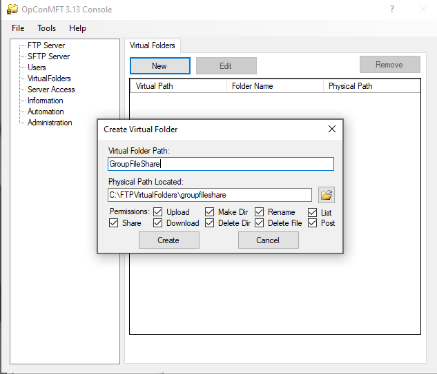

# MFT Server Virtual Folders

Virtual Folders are non-existent folders that are nonetheless visible to connected users.  
A Virtual Folder may be mapped to a directory path on your file system that is located outside the hierarchical directory tree of a user's Home Folder.

## Creating Virtual Folders

Before creating a virtual folder, create the real folder that will be mapped to the virtual folder name.

Start the OpCon MFT Server Console, by Selecting the **Server Console** in the **OpConMFT n.nn** Application Menu.

Select the **VirtualFolders** Menu Item.

- Enter a name for the virtual folder in the **Virtual Folder Path** field.
- Browse to the created folder that will be used to manage the files.
- Manage the permissions available for the virtual folder by selecting / de-selecting the checkboxes.
- Select **Create** to create the virtual folder.

## Sharing Folders Between Accounts

Virtual Folders are commonly used to share a single physical directory with multiple user accounts. 

- Logon on to the MFT Server through the web browser.
- Select the created virtual folder.
- Select **Create Share**.
- Copy the generated URL and share it.

## Sharing Network Folders

Another common use of Virtual Folders is to give users access to network shares or other folders not otherwise available under the hierarchical directory tree of a user's Home Folder. 

