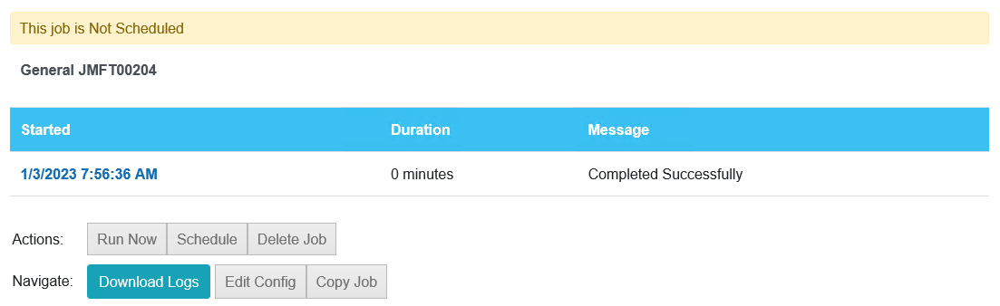
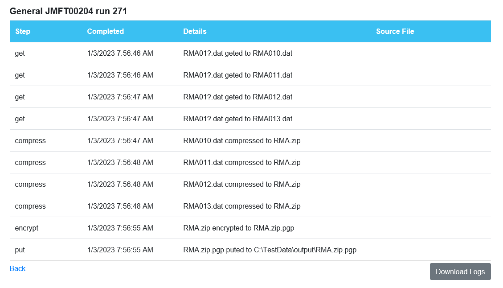
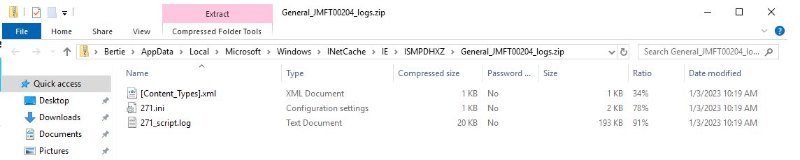

# Trouble Shooting
The OpConMFT Implementation uses the SMANetcom ProxyAgent Framework for communication between OpCon and the OpConMFT Agent. There is
no 'OpCon' Agent to provide the communications connection, instead SMANetcom communicates directly with the external OpConMFT Agent. 
Communication consists of Rest-API calls between the ProxyAgent Framework and the OpConMFT Agent. This means that the OpConMFT Agent 
Service becomes the OpCon Agent. 

It should be noted that there are no **tracking files** or **job logs** stored within the ProxyAgent Framework. Job status and job logs are 
retrieved directly from the OpConMFT Agent.

## SMAApiClient Module
The SMAApiClient module provides a generic Rest-API capability that forms the basis of all requests passed between the ProxyAgent Framework
and the OpConMFT Agent. 

## SMAApiClientModels Module
The SMAApiClientModels module provides some generic definitions for establishing Rest-API connections as well as specific libraries to 
support Rest-API requests to the OpConMFT Agent. It also includes the routines that generate the various steps from the OpCon task
definitions which are passed to the OpConMFT Agent.

## SMANetcom ProxyAgent Framework
The ProxyAgent framework is part of SMANetcom and is responsible for passing requests to the Associated ProxyAgent. 

SMANetcom retrieves the TX1 and TX2 messages from the MSGS_TO_SAM table and checks to see if these messages are for ProxyAgents. If
the messages are for ProxyAgents, the ProxyAgent framework delivers the messages to the associated ProxyAgent. Returned messages are
placed in the MSGS_TO_SAM table by the ProxyAgent framework.

During startup or agent startup requests, the ProxyAgent framework extracts the agent configuration from the OpCon database, creates a
Rest-API client spawns the specific ProxyAgent (in this case the SMAMftProxyAgent) passing the created Rest-API client. After this, it 
generates TX4 messages and submits these to the spawned ProxyAgent. 

The ProxyAgent Framework also generates TXH messages on a timed basis and passes these to the spawned ProxyAgent, which is then used to
establish if the OpConMFT Agent is available for processing.

Job start (TX1) and job status (TX2) messages are also passed to the ProxyAgent for processing.

## SMAMftAgentProxy
This module is part of the new SMANetcom Adapter framework and receives TX messages from SMANetcom. These TX messages are transformed into
requests that the target OpConMFT Agent understands.

- **%%TX1**        Converted to a **/api/job/start/{groupName}.{correctedJobName}/withtag/{tagName}** job start request.
- **%%TX2**        Converted to a **/api/run/status/{RunId}** job status request. 
- **%%TX4**        Converted to a **api/agent/info** request and is used to see if the OpConMFT Agent is available.
- **%%TXH**        Converted to a **api/agent/info** request and is used to see if the OpConMFT Agent is available.

OpConMFT jobs are defined within the OpCon environment and run within the OpConMFT Agent environment. 
When a job is started the following happens:

- OpCon checks to see if the OpConMFT Agent associated with the task is active (i.e. **UP**).
- If the OpConMFT Agent is active, the OpConMFT job start request %%TX1 is passed to the SMAMftAgentProxy for processing.
- The SMAMftAgentProxy extracts the OpConMFT job information from the %%TX1 message, converts them into steps.
- A check is made to see if this is a job restart, by examining the RunId field associated with the job. If the RunId is **0** or **null** a new job is started. If the Runid is non zero a job restart of the OpCOnMFT Agent job is performed.
- The job start request returns the OpConMFT Agent RunId. The RunId is stored in the SMASTER_AUX tables associated with the OpCon task.
- The SMAMftAgentProxy returns information to OpCon to indicate that the job has been started.
- The OpConMFT Agent Job is tracked by the SMAMftAgentProxy and status information is returned to OpCon.
- When the job completes successfully, the RunId value is set to 0.

### Steps supported by SmaMftAgentProxy
The SMAMftAgentProxy supports the following steps. More information on the steps can be found in the **task-definition.md** document.

- get step        generated from the OpCon Source information.
- put step        generated from the OpCon Destination information.
- name step       generated from the OpCon Destination information.
- compress step   generated from the OpCon Compression information.
- decompress step generated from OpCon Compression information.
- encrypt step    generated from OpCon Encryption information.
- decrypt step    generated from OpCon Encryption information. 

## SMALSAMDataRetriever
The SMALSAMDataRetriever includes additional capabilities to retrieve the job logs from the OpConMFT Agent. When the job has been started the JORS
entry is written into the SMASTER_AUX table (OpConMFT,MFT001,JMFT00101_0000000050). This information contains the job information as well as the 
OpConMFT Agent information. The OpConMFT Agent information is retrieved from the OpCon agent configuration and a request for the job log is passed to
the target OpConMFT Agent.

OpConMFT,MFT001,JMFT00101_0000000050 where
- **OpConMFT** is the job type
- **MFT001** is the OpConMFT Agent name
- **JMFT00101_0000000050** is the OpCon JobID (the numeric portion 0000000050 is used to get the associated OpConMFT Agent jobid).

The retrieved job log contains the status of the job as well as the result of each step performed within the job. It should be noted that if wild cards
are found, there will be a step performed for each matching file. If compression is used, following the compress step, there will only be a single step
for each execution.

```
Example

GroupName    : General
JobName      : JMFT00204
OpCon JobId  : 0000000312
MFT JobId    : 271
Start Time   : 03/01/2023 07:56:36
End Time     : 03/01/2023 07:56:56
Last Message : Completed successfully
Result       : 0
-----------------------------------
Job Step Information --------------
------------
Step Name   get
Result      0
Timestamp   03/01/2023 07:56:46
StepDetails RMA01?.dat geted to RMA010.dat
Source File RMA01?.dat
Target File C:\Program Files\Robo-FTP 3.13\ProgramData\FrameWork\data\General\JMFT00204\271\get\intermediate\RMA010.dat
------------
------------
Step Name   get
Result      0
Timestamp   03/01/2023 07:56:46
StepDetails RMA01?.dat geted to RMA011.dat
Source File RMA01?.dat
Target File C:\Program Files\Robo-FTP 3.13\ProgramData\FrameWork\data\General\JMFT00204\271\get\intermediate\RMA011.dat
------------
------------
Step Name   get
Result      0
Timestamp   03/01/2023 07:56:47
StepDetails RMA01?.dat geted to RMA012.dat
Source File RMA01?.dat
Target File C:\Program Files\Robo-FTP 3.13\ProgramData\FrameWork\data\General\JMFT00204\271\get\intermediate\RMA012.dat
------------
------------
Step Name   get
Result      0
Timestamp   03/01/2023 07:56:47
StepDetails RMA01?.dat geted to RMA013.dat
Source File RMA01?.dat
Target File C:\Program Files\Robo-FTP 3.13\ProgramData\FrameWork\data\General\JMFT00204\271\get\intermediate\RMA013.dat
------------
------------
Step Name   compress
Result      0
Timestamp   03/01/2023 07:56:47
StepDetails RMA010.dat compressed to RMA.zip
Source File C:\Program Files\Robo-FTP 3.13\ProgramData\FrameWork\data\General\JMFT00204\271\get\files\RMA010.dat
Target File RMA.zip
------------
------------
Step Name   compress
Result      0
Timestamp   03/01/2023 07:56:48
StepDetails RMA011.dat compressed to RMA.zip
Source File C:\Program Files\Robo-FTP 3.13\ProgramData\FrameWork\data\General\JMFT00204\271\get\files\RMA011.dat
Target File RMA.zip
------------
------------
Step Name   compress
Result      0
Timestamp   03/01/2023 07:56:48
StepDetails RMA012.dat compressed to RMA.zip
Source File C:\Program Files\Robo-FTP 3.13\ProgramData\FrameWork\data\General\JMFT00204\271\get\files\RMA012.dat
Target File RMA.zip
------------
------------
Step Name   compress
Result      0
Timestamp   03/01/2023 07:56:48
StepDetails RMA013.dat compressed to RMA.zip
Source File C:\Program Files\Robo-FTP 3.13\ProgramData\FrameWork\data\General\JMFT00204\271\get\files\RMA013.dat
Target File RMA.zip
------------
------------
Step Name   encrypt
Result      0
Timestamp   03/01/2023 07:56:55
StepDetails RMA.zip encrypted to RMA.zip.pgp
Source File C:\Program Files\Robo-FTP 3.13\ProgramData\FrameWork\data\General\JMFT00204\271\compress\files\RMA.zip
Target File RMA.zip.pgp
------------
------------
Step Name   put
Result      0
Timestamp   03/01/2023 07:56:55
StepDetails RMA.zip.pgp puted to C:\TestData\output\RMA.zip.pgp
Source File C:\Program Files\Robo-FTP 3.13\ProgramData\FrameWork\data\General\JMFT00204\271\encrypt\files\RMA.zip.pgp
Target File C:\TestData\output\RMA.zip.pgp
------------
-----------------------------------
```

## Retrieving Job Information from OpConMFT Agent
It is possible to retrieve the job information using the OpConMFT Agent Web Server. From the initial page, select **JOBS** and then the job group associated with the job (i.e. **GENERAL**). A list
of jobs will be displayed. Select the job (remember the jobname consists of the group name and the OpCon jobname minus any special characters, i.e. department JMFT002-04 becomes JMFT00204). Once 
selected the job information can be downloaded.



The job step information can be viewed by selecting the **Started value**, or the job logs can be downloaded by selecting the **Download Logs** button.



The displayed step information shows the jobname, the OpConMFT Agent jobid and the sequence of the steps and the action completed on each file.

When the **Download Logs** is button is selected, a message appears on the bottom of the screen. To view the information select **Open**, to save the information for Support purposes select **Save**.


The job log information consists of three files.
- **[Content_Type].xml** 
- **271.ini** This is the generated job information from the OpConMFT job definitions (271 is the OpConMFT Agent jobid).
- **271_script.log** This is trace file associated with the task execution.  

```
271.ini file showing generated step definitions and order of step execution.

[getStepDetails]
;
step_kind=get
specification=RMA01?.dat
flat=False
archive_files=False
persistent_source=False
include_directories=False
preserve_paths=False
endpoint=SVR2
report_on_error=True
skip_email_on_error=True
continue_on_error=False
error1164_report_on_error=True
error1164_skip_email_on_error=True
error1164_continue_on_error=False

[compressStepDetails]
;
step_kind=compress
specification=*
target_file=RMA.zip
archive_files=False
report_on_error=True
skip_email_on_error=True
continue_on_error=False
error1164_report_on_error=True
error1164_skip_email_on_error=True
error1164_continue_on_error=False

[encryptStepDetails]
;
step_kind=encrypt
specification=*
archive_files=False
report_on_error=True
skip_email_on_error=True
continue_on_error=False
error1164_report_on_error=True
error1164_skip_email_on_error=True
error1164_continue_on_error=False
key=SAT-312
cipher=AES
signing_key=SAT-312

[putStepDetails]
;
step_kind=put
specification=*
flat=False
archive_files=False
persistent_source=False
include_directories=False
preserve_paths=True
overwrite=True
endpoint=SVR1
report_on_error=True
skip_email_on_error=True
continue_on_error=False
error1164_report_on_error=True
error1164_skip_email_on_error=True
error1164_continue_on_error=False
```

## Support Considerations
There are various entries in the database tables that are not visible or contain special values that can influence job execution.

### MACH Table
The port number used by the OpConMFT Agent is greater than 50000. This represents a problem as the maximum value allowed in the field is 32000.
The port number is therefore saved as a negative number and converted to the correct value before use by the OpCon software (i.e. a port number
of 50405 is stored as -15131).

### LSAMTYPES Table
The new OpConMFT Agent is defined in the LSAMTYPES table as **LSAMTYPEID** 25 and **LSAMTYPDESC** OpConMFT.

### LSAMTYPES_AUX Table

For the OpConMFT Agent to support the JORS capability, the following two entries must be present:
**LSAMTYPEID** | **LAFC** | **LASEQNO** | **LAVALUE**
-------------- | -------- | ----------- | -----------
25             | 62       | 1           | True
25             | 120      | 1           | True

### JMASTER_AUX Table

During job definition, the **Department** name is saved as the job group name (any special characters are removed). The value is stored in the
field code 25002.

### SMASTER_AUX Table

During job execution, the JORS indicator value is stored in field code 62 of the stored job definition.
During job execution, the OpCon Agent jobid is stored in field code 25001 of the stored job definition. If the job completes successfully, this code
is set to 0, otherwise it will contain the OpCon Agent jobid. This value is used to restart a failed OpCon Agent task.

